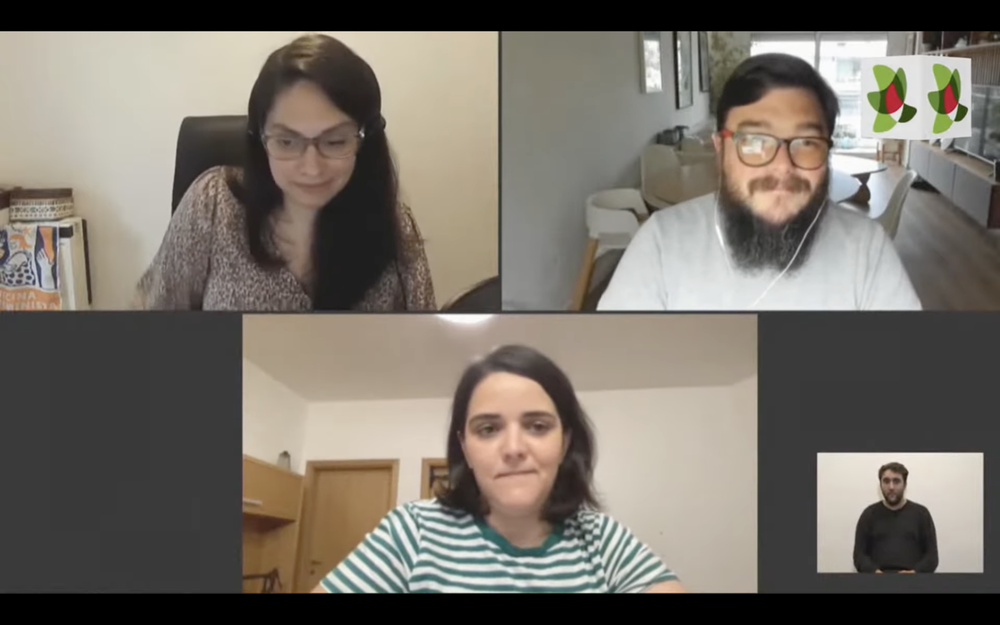

Con el objetivo de promover ciudadanías críticas, reflexivas, seguras, responsables, creativas y participativas, **Agesic** y **Plan Ceibal** desarrollan desde hace cuatro años la Jornada de Ciudadanía Digital. En esta edición el lema de la jornada fue "Crear y participar: habilidades que democratizan el entorno digital".   

La mesa fue moderada por Victoria Gadea y contó con la participación de:

  * **Biodiversidata** - Florencia Grattarola  
  * **Data Uruguay** - Daniel Carranza   
  * **Mediactivismo** - Mariana Fossatti  

