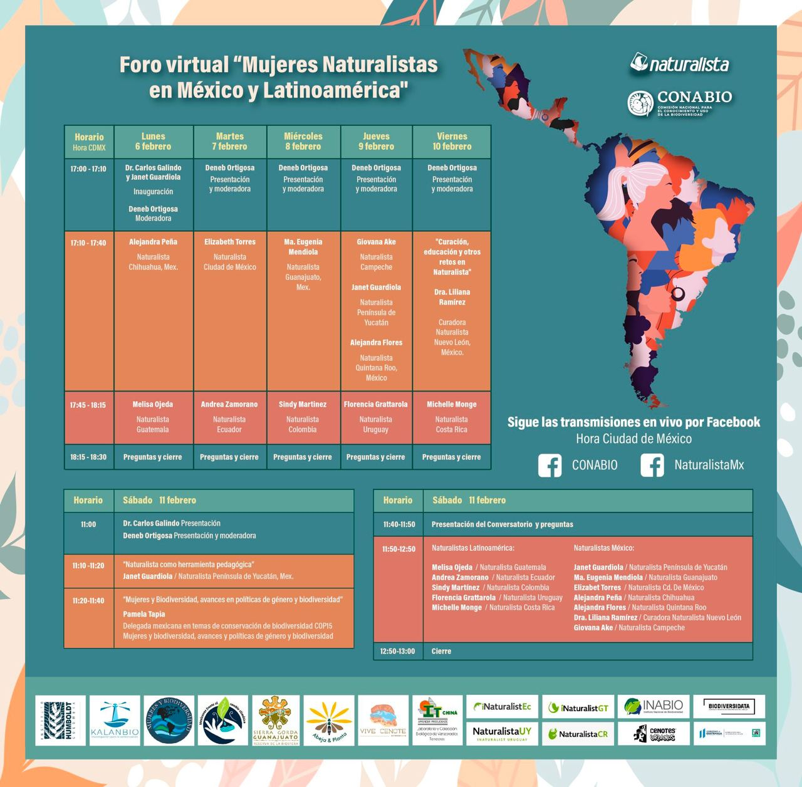

Foro virtual en el marco del día de las niñas y mujeres en la ciencia. Organizado por CONABIO, México.

## Día 4: Ciencia Participativa

### Moderadora:
- Deneb Ortigosa

### Exponentes
- Giovana Ake (Naturalista Campeche)
- Janet Guardiola (Naturalista Península de Yucatán)
- Alejandra Flores (Naturalista Quintana Roo)
- Florencia Grattarola (Naturalista Uruguay)

Presentación sobre mi recorrido hacia crear Naturalista Uruguay, los Eventos de Ciencia Comunitaria con NaturalistaUY, y un cierre sobre mujeres, naturalistas e investigadoras que me inspiraron
