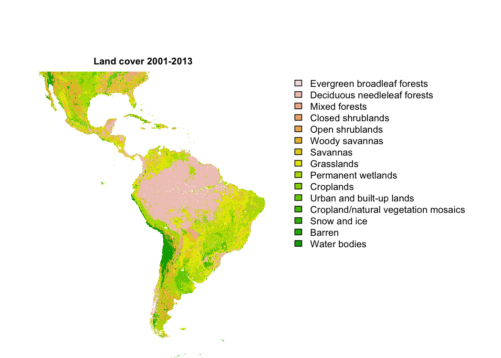

Searching to download MODIS data to use on spatial analyses :earth_americas: in R, I found this amazing package called `MODIStsp`[^1] (MODIS Time Series Processing Tool). **Here is the code I used to download Terra MODIS yearly Land Cover data for two time periods.**

    library(MODIStsp)
    library(terra)
    library(sf)
    library(tidyverse)

## MODIS

MODIS data (see: [Products](https://modis.gsfc.nasa.gov/data/dataprod/)) are usually distributed in different spatial resolution (250/500m/1km) and temporal composite (daily/8-day/16-day/monthly/yearly) combinations for both sensors. **‘MOD’** are products from the Terra satellite.

    MODIStsp_get_prodnames()

    ##   [1] "Surf_Ref_8Days_500m (M*D09A1)"                   
    ##   [2] "Surf_Ref_Daily_005dg (M*D09CMG)"                 
    ##   [3] "Surf_Ref_Daily_500m (M*D09GA)"                   
    ##   [4] "Surf_Ref_Daily_250m (M*D09GQ)"                   
    ##   [5] "Surf_Ref_8Days_250m (M*D09Q1)"                   
    ##   [6] "Ocean_Ref_Daily_1Km (M*DOCGA)"                   
    ##   [7] "Therm_Daily_1Km (M*DTBGA)"                       
    ##   [8] "Snow_Cov_Daily_500m (M*D10A1)"                   
    ##   [9] "Snow_Cov_8-Day_500m (M*D10_A2)"                  
    ##  [10] "Snow_Cov_Day_0.05Deg (M*D10C1)"                  
    ##  [11] "Snow_Cov_8-Day0.05Deg CMG (M*D10C2)"             
    ##  [12] "Snow_Cov_Month_0.05Deg CMG (M*D10CM)"            
    ##  [13] "Surf_Temp_Daily_005dg (M*D11C1)"                 
    ##  [14] "Surf_Temp_Daily_1Km (M*D11A1)"                   
    ##  [15] "Surf_Temp_8Days_1Km (M*D11A2)"                   
    ##  [16] "Surf_Temp_Daily_GridSin (M*D11B1)"               
    ##  [17] "Surf_Temp_8Days_GridSin (M*D11B2)"               
    ##  [18] "Surf_Temp_Monthly_GridSin (M*D11B3)"             
    ##  [19] "Surf_Temp_8Days_005dg (M*D11C2)"                 
    ##  [20] "Surf_Temp_Monthly_005dg (M*D11C3)"               
    ##  [21] "LST_3band_emissivity_Daily_1km (M*D21A1D)"       
    ##  [22] "LST_3band_emissivity_Daily_1km_night (M*D21A1N)"
    ##  [23] "LST_3band_emissivity_8day_1km (M*D21A2)"         
    ##  [24] "BRDF_Albedo_ModelPar_Daily_500m (MCD43A1)"       
    ##  [25] "BRDF_Albedo_Quality_Daily_500m (MCD43A2)"        
    ##  [26] "Albedo_Daily_500m (MCD43A3)"                     
    ##  [27] "BRDF_Adj_Refl_Daily_500m (MCD43A4)"              
    ##  [28] "BRDF_Albedo_ModelPar_Daily_005dg (MCD43C1)"      
    ##  [29] "BRDF_Albedo_Quality_Daily_005dg (MCD43C2)"       
    ##  [30] "Albedo_Daily_005dg (MCD43C3)"                    
    ##  [31] "BRDF_Adj_Refl_16Day_005dg (MCD43C4)"             
    ##  [32] "AlbPar_1_B1_Daily_30ArcSec (MCD43D01)"           
    ##  [33] "AlbPar_2_B1_Daily_30ArcSec (MCD43D02)"           
    ##  [34] "AlbPar_3_B1_Daily_30ArcSec (MCD43D03)"           
    ##  [35] "AlbPar_1_B2_Daily_30ArcSec (MCD43D04)"           
    ##  [36] "AlbPar_2_B2_Daily_30ArcSec (MCD43D05)"           
    ##  [37] "AlbPar_3_B2_Daily_30ArcSec (MCD43D06)"           
    ##  [38] "AlbPar_1_B3_Daily_30ArcSec (MCD43D07)"           
    ##  [39] "AlbPar_2_B3_Daily_30ArcSec (MCD43D08)"           
    ##  [40] "AlbPar_3_B3_Daily_30ArcSec (MCD43D09)"           
    ##  [41] "AlbPar_1_B4_Daily_30ArcSec (MCD43D10)"           
    ##  [42] "AlbPar_2_B4_Daily_30ArcSec (MCD43D11)"           
    ##  [43] "AlbPar_3_B4_Daily_30ArcSec (MCD43D12)"           
    ##  [44] "AlbPar_1_B4_Daily_30ArcSec (MCD43D13)"           
    ##  [45] "AlbPar_2_B4_Daily_30ArcSec (MCD43D14)"           
    ##  [46] "AlbPar_3_B4_Daily_30ArcSec (MCD43D15)"           
    ##  [47] "AlbPar_1_B5_Daily_30ArcSec (MCD43D16)"           
    ##  [48] "AlbPar_2_B5_Daily_30ArcSec (MCD43D17)"           
    ##  [49] "AlbPar_3_B5_Daily_30ArcSec (MCD43D18)"           
    ##  [50] "AlbPar_1_B6_Daily_30ArcSec (MCD43D19)"           
    ##  [51] "AlbPar_2_B6_Daily_30ArcSec (MCD43D20)"           
    ##  [52] "AlbPar_3_B6_Daily_30ArcSec (MCD43D21)"           
    ##  [53] "AlbPar_1_Vis_Daily_30ArcSec (MCD43D22)"          
    ##  [54] "AlbPar_2_Vis_Daily_30ArcSec (MCD43D23)"          
    ##  [55] "AlbPar_3_Vis_Daily_30ArcSec (MCD43D24)"          
    ##  [56] "AlbPar_1_NIR_Daily_30ArcSec (MCD43D25)"          
    ##  [57] "AlbPar_2_NIR_Daily_30ArcSec (MCD43D26)"          
    ##  [58] "AlbPar_3_NIR_Daily_30ArcSec (MCD43D27)"          
    ##  [59] "AlbPar_1_SWIR_Daily_30ArcSec (MCD43D28)"         
    ##  [60] "AlbPar_2_SWIR_Daily_30ArcSec (MCD43D29)"         
    ##  [61] "AlbPar_3_SWIR_Daily_30ArcSec (MCD43D30)"         
    ##  [62] "BRDF_Albedo_Quality_Daily_30ArcSec (MCD43D31)"   
    ##  [63] "BRDF_Albedo_SolNoon_Daily_30ArcSec (MCD43D32)"   
    ##  [64] "Alb_ValObs_B1_Daily_30ArcSec (MCD43D33)"         
    ##  [65] "Alb_ValObs_B2_Daily_30ArcSec (MCD43D34)"         
    ##  [66] "Alb_ValObs_B3_Daily_30ArcSec (MCD43D35)"         
    ##  [67] "Alb_ValObs_B4_Daily_30ArcSec (MCD43D36)"         
    ##  [68] "Alb_ValObs_B5_Daily_30ArcSec (MCD43D37)"         
    ##  [69] "Alb_ValObs_B6_Daily_30ArcSec (MCD43D38)"         
    ##  [70] "Alb_ValObs_B7_Daily_30ArcSec (MCD43D39)"         
    ##  [71] "BRDF_Albedo_Snow_Daily_30ArcSec (MCD43D40)"      
    ##  [72] "BRDF_Alb_Unc_Daily_30ArcSec (MCD43D41)"          
    ##  [73] "BRDF_Alb_BSA_B1_Daily_30ArcSec (MCD43D42)"       
    ##  [74] "BRDF_Alb_BSA_B2_Daily_30ArcSec (MCD43D43)"       
    ##  [75] "BRDF_Alb_BSA_B3_Daily_30ArcSec (MCD43D44)"       
    ##  [76] "BRDF_Alb_BSA_B4_Daily_30ArcSec (MCD43D45)"       
    ##  [77] "BRDF_Alb_BSA_B5_Daily_30ArcSec (MCD43D46)"       
    ##  [78] "BRDF_Alb_BSA_B6_Daily_30ArcSec (MCD43D47)"       
    ##  [79] "BRDF_Alb_BSA_B7_Daily_30ArcSec (MCD43D48)"       
    ##  [80] "BRDF_Alb_BSA_Vis_Daily_30ArcSec (MCD43D49)"      
    ##  [81] "BRDF_Alb_BSA_NIR_Daily_30ArcSec (MCD43D50)"      
    ##  [82] "BRDF_Alb_BSA_SWIR_Daily_30ArcSec (MCD43D51)"     
    ##  [83] "BRDF_Alb_WSA_B1_Daily_30ArcSec (MCD43D52)"       
    ##  [84] "BRDF_Alb_WSA_B2_Daily_30ArcSec (MCD43D53)"       
    ##  [85] "BRDF_Alb_WSA_B3_Daily_30ArcSec (MCD43D54)"       
    ##  [86] "BRDF_Alb_WSA_B4_Daily_30ArcSec (MCD43D55)"       
    ##  [87] "BRDF_Alb_WSA_B5_Daily_30ArcSec (MCD43D56)"       
    ##  [88] "BRDF_Alb_WSA_B6_Daily_30ArcSec (MCD43D57)"       
    ##  [89] "BRDF_Alb_WSA_B7_Daily_30ArcSec (MCD43D58)"       
    ##  [90] "BRDF_Alb_WSA_Vis_Daily_30ArcSec (MCD43D59)"      
    ##  [91] "BRDF_Alb_WSA_NIR_Daily_30ArcSec (MCD43D60)"      
    ##  [92] "BRDF_Alb_WSA_SWIR_Daily_30ArcSec (MCD43D61)"     
    ##  [93] "BRDF_Albedo_NBAR_Band1_Daily_30ArcSec (MCD43D62)"
    ##  [94] "BRDF_Albedo_NBAR_Band2_Daily_30ArcSec (MCD43D63)"
    ##  [95] "BRDF_Albedo_NBAR_Band3_Daily_30ArcSec (MCD43D64)"
    ##  [96] "BRDF_Albedo_NBAR_Band4_Daily_30ArcSec (MCD43D65)"
    ##  [97] "BRDF_Albedo_NBAR_Band5_Daily_30ArcSec (MCD43D66)"
    ##  [98] "BRDF_Albedo_NBAR_Band6_Daily_30ArcSec (MCD43D67)"
    ##  [99] "BRDF_Albedo_NBAR_Band7_Daily_30ArcSec (MCD43D68)"
    ## [100] "Vegetation_Indexes_16Days_500m (M*D13A1)"        
    ## [101] "Vegetation_Indexes_16Days_1Km (M*D13A2)"         
    ## [102] "Vegetation_Indexes_Monthly_1Km (M*D13A3)"        
    ## [103] "Vegetation_Indexes_16Days_005dg (M*D13C1)"       
    ## [104] "Vegetation_Indexes_Monthly_005dg (M*D13C2)"      
    ## [105] "Vegetation Indexes_16Days_250m (M*D13Q1)"        
    ## [106] "LAI_8Days_500m (MCD15A2H)"                       
    ## [107] "LAI_4Days_500m (MCD15A3H)"                       
    ## [108] "LAI_8Days_500m (M*D15A2H)"                       
    ## [109] "Net_ET_8Day_500m (M*D16A2)"                      
    ## [110] "Net_ETgf_8Day_500m (M*D16A2GF)"                  
    ## [111] "Net_ETgf_Yearly_500m (M*D16A3GF)"                
    ## [112] "Gross_PP_8Days_500m (M*D17A2H)"                  
    ## [113] "Gross_PP_GapFil_8Days_500m (M*D17A2HGF)"         
    ## [114] "Net_PP_GapFil_Yearly_500m (M*D17A3HGF)"          
    ## [115] "Veg_Cont_Fields_Yearly_250m (MOD44B)"            
    ## [116] "Land_Wat_Mask_Yearly_250m (MOD44W)"              
    ## [117] "Burned_Monthly_500m (MCD64A1)"                   
    ## [118] "ThermalAn_Fire_Daily_1Km (M*D14A1)"              
    ## [119] "ThermalAn_Fire_8Days_1Km (M*D14A2)"              
    ## [120] "LandCover_Type_Yearly_005dg (MCD12C1)"           
    ## [121] "LandCover_Type_Yearly_500m (MCD12Q1)"            
    ## [122] "LandCover_Dynamics_Yearly_500m (MCD12Q2)"        
    ## [123] "Dwnwrd_Srw_Rad_3h_005dg (MCD18A1)"               
    ## [124] "Dwnwrd_PAR_3h_005dg (MCD18A2)"                   
    ## [125] "MAIA_Land_Surf_BRF (MCD19A1)"                    
    ## [126] "MAIA_Land_AOT_daily (MCD19A2)"

I want to get the [Land Cover Type Yearly L3 Global 500m](https://lpdaac.usgs.gov/products/mcd12q1v006/) (500m spatial
resolution and annual temporal composite). There are five different land cover classification schemes, we will be using the primary land cover scheme (**LC1**) which identifies 17 classes defined by the [IGBP](http://www.igbp.net) (International Geosphere-Biosphere Programme), including 11 natural vegetation classes, three human-altered classes, and three non-vegetated classes.

With `MODIStsp_get_prodlayers()` you can see all the layers of the product:

    MODIStsp_get_prodlayers("MCD12Q1")$bandnames

    ##  [1] "LC1"                 "LC2"                 "LC3"                
    ##  [4] "LC4"                 "LC5"                 "LC_Prop1"           
    ##  [7] "LC_Prop2"            "LC_Prop3"            "LC_Prop1_Assessment"
    ## [10] "LC_Prop2_Assessment" "LC_Prop3_Assessment" "LC_QC"              
    ## [13] "LC_LW"

### Download

To download MODIS data through the **NASA http server**, we need to create a profile at <https://urs.earthdata.nasa.gov/home> to get a `user` and `password`. We need to define the `out_folder` to where the data are going to be downloaded. We also need to specify which product (`selprod`), band (`bandsel`) and `sensor` we want to download. We also need to define a temporal period, as `start_date` and `end_date`, and a spatial output resolution, for which we will select a **bounding box** as `spatmeth`. We will then provide the `bbox` values (xmin, ymin, xmax, ymax) from our study area (Latin America) in our desired output projection. We will also specify the **output projection** (`output_proj`) as ‘+proj=laea +lon\_0=-73.125 +lat\_0=0 +datum=WGS84 +units=m +no\_defs’ Equatorial Lambert azimuthal equal-area (you can also use EPSG code or WKT string here).

To know more about other parameters of the MODIStsp main function check `?MODIStsp`.

    MODIStsp(gui             = FALSE,
             out_folder      = 'big_data/',
             out_folder_mod  = 'big_data/',
             selprod         = 'LandCover_Type_Yearly_500m (MCD12Q1)',
             bandsel         = 'LC1',
             sensor          = 'Terra',
             user            = '' , # your username for NASA http server
             password        = '',  # your password for NASA http server
             start_date      = '2000.01.01',
             end_date        = '2022.12.31',
             verbose         = TRUE,
             bbox            =  c(-5596641.0845, -6673508.6914, 4698677.0087, 4157242.8202), #bbox of Latam
             spatmeth        = 'bbox',
             out_format      = 'GTiff',
             compress        = 'LZW',
             out_projsel     = 'User Defined',
             output_proj     = '+proj=laea +lon_0=-73.125 +lat_0=0 +datum=WGS84 +units=m +no_defs',
             delete_hdf      = TRUE,
             parallel        = TRUE
             )

## The Data

Once the data are downloaded we will process the rasters using the `terra` package.

    # PRE: 2000-2013
    landcover_pre_files <- list.files('big_data/LandCover_Type_Yearly_500m_v6/LC1', '200[0-1]|201[0-3]', full.names = T)
    landcover_pre_c <- rast(landcover_pre_files)
    land_pre <- modal(landcover_pre_c)
    names(land_pre) <- 'land_pre'
    rm(landcover_pre_c)

    ## class       : SpatRaster
    ## dimensions  : 25051, 23813, 1  (nrow, ncol, nlyr)
    ## resolution  : 432.3402, 432.3481  (x, y)
    ## extent      : -5596641, 4698677, -6673509, 4157243  (xmin, xmax, ymin, ymax)
    ## coord. ref. : +proj=laea +lat_0=0 +lon_0=-73.125 +x_0=0 +y_0=0 +datum=WGS84 +units=m +no_defs
    ## source      : land_pre.tif
    ## name        : landcover_pre
    ## min value   :             1
    ## max value   :            17

    # POS: 2014-2022
    landcover_pos_files <- list.files('big_data/LandCover_Type_Yearly_500m_v6/LC1', '201[4-9]|202[0-9]', full.names = T)
    landcover_pos_c <- rast(landcover_pos_files)
    land_pos <- modal(landcover_pos_c)
    names(land_pos) <- 'land_pos'
    rm(landcover_pos_c)

    ## class       : SpatRaster
    ## dimensions  : 25051, 23813, 1  (nrow, ncol, nlyr)
    ## resolution  : 432.3402, 432.3481  (x, y)
    ## extent      : -5596641, 4698677, -6673509, 4157243  (xmin, xmax, ymin, ymax)
    ## coord. ref. : +proj=laea +lat_0=0 +lon_0=-73.125 +x_0=0 +y_0=0 +datum=WGS84 +units=m +no_defs
    ## source      : land_pos.tif
    ## name        : landcover_pos
    ## min value   :             1
    ## max value   :            17

As the values are numeric and we want the categories, we will rename them. Please bear in mind that your landcover layer might not have the same classes/levels as mine. Check here the classification values: [MCD12_User_Guide_V6](https://lpdaac.usgs.gov/documents/101/MCD12_User_Guide_V6.pdf) (see page 7 Classification Legends). 

    # Renaming IGBP classification levels
    levels(land_pre$land_pre) <- c( "Evergreen needleleaf forests",
                                    "Evergreen broadleaf forests",
                                    "Deciduous needleleaf forests",
                                    "Deciduous broadleaf forests",
                                    "Mixed forests",
                                    "Closed shrublands",
                                    "Open shrublands",
                                    "Woody savannas",
                                    "Savannas",
                                    "Grasslands",
                                    "Permanent wetlands",
                                    "Croplands",
                                    "Urban and built-up lands",
                                    "Cropland/natural vegetation mosaics",
                                    "Snow and ice",
                                    "Barren",
                                    "Water bodies")

    levels(land_pos$land_pos) <- c( "Evergreen needleleaf forests",
                                    "Evergreen broadleaf forests",
                                    "Deciduous needleleaf forests",
                                    "Deciduous broadleaf forests",
                                    "Mixed forests",
                                    "Closed shrublands",
                                    "Open shrublands",
                                    "Woody savannas",
                                    "Savannas",
                                    "Grasslands",
                                    "Permanent wetlands",
                                    "Croplands",
                                    "Urban and built-up lands",
                                    "Cropland/natural vegetation mosaics",
                                    "Snow and ice",
                                    "Barren",
                                    "Water bodies")

### Plot

Finally, the results :zap:

    plot(land_pre, main='Land cover 2001-2013', axes=F, mar=c(0,0,5,15))

    plot(land_pos, main='Land cover 2014-2020', axes=F, mar=c(0,0,5,15))

### And, that’s all !

Hope you find this useful too :sparkles:

[^1]: L. Busetto, L. Ranghetti (2016) MODIStsp: An R package for automatic preprocessing of MODIS Land Products time series, Computers & Geosciences, Volume 97, Pages 40-48, ISSN 0098-3004, <https://doi.org/10.1016/j.cageo.2016.08.020>. URL <https://github.com/ropensci/MODIStsp/> :octocat:
