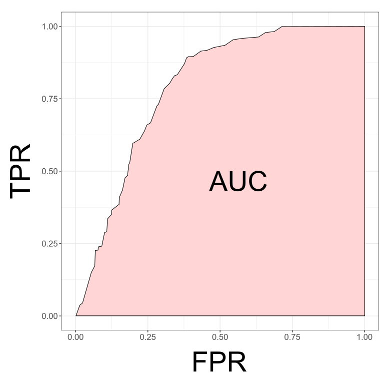

Previously, I showed how to calculate [Tjur's R2 in JAGS](post/tjur-rsquared-in-jags/) to evaluate the predictive performance of a presence-absence model. In this post, I will calculate AUC.

## ROC and AUC

To measure the discrimination performance of our model, we can assess the agreement between predictions ($\psi$) and actual observations ($y$), based on a series of probability thresholds.

|                                  | recorded present ($y_i = 1$) | recorded absent ($y_i = 0$) |
|----------------------------------|------------------------------|-----------------------------|
| predicted present ($\psi_i = 1$) | **TP** (true positive)       | **FP** (false positive)     |
| predicted absent  ($\psi_i = 0$) | **FN** (false negative)      | **TN** (true negative)      |


Sensitivity (or the true positive rate **TPR**) and specificity (or the true negative rate) — measure the proportion of sites at which the observations and the predictions agree, while the false positive rate (**FPR**) and the false negative rate — measure the proportion of sites at which the observations and the predictions disagree ([Hanley and McNeil 1982](https://pubs.rsna.org/doi/epdf/10.1148/radiology.143.1.7063747)).

  - **Sensitivity** or **True Postivie Rate**:  
  $TPR = \frac{TP}{TP + FN}$  
  <br>
  - **1 - Specificity** or **False Positive Rate**:  
  $FPR = \frac{FP}{FP + TN}$

Over a range of probability threshold levels, each pair of true positive and false positive values can be plotted as the y and x coordinates respectively. The series of points in the graph defines a smooth curve, which is called the relative operating characteristic (ROC) curve. The area under the ROC curve, or AUC, is thus the proportion of the total area of the unit square defined by the false positive and true positive axes.



> **AUC** ranges from 0.5 for models with no discrimination ability, to 1 for models with perfect discrimination. AUC between 0.5 and 0.7 indicate poor discrimination capacity, values between 0.7 and 0.9 indicate a reasonable discrimination ability appropriate for many uses, and rates higher that 0.9 indicate very good discrimination ([Pearce and Ferrier 2000](https://doi.org/10.1016/S0304-3800(00)00322-7)).

## AUC Calculation

A simple way to measure the area under the ROC curve is using the trapezoidal rule to calculate the area directly from the points on the graph. The area of a trapezoid is $\frac{height}{2} * width$


Then we can calculate AUC as:

$A_1 = \frac{y_1 + y_0}{2} * (x_1 - x_0)$  
$A_2 = \frac{y_2 + y_1}{2} * (x_2 - x_1)$  
$A_3 = \frac{y_3 + y_2}{2} * (x_3 - x_2)$  
$A_4 = \frac{y_4 + y_3}{2} * (x_4 - x_3)$  

$AUC = A_1 + A_2 + A_3 + A_4 <= 1$

In JAGS:

```r
auc <- sum((sens[2:length(sens)]+sens[1:(length(sens)-1)])/2 * -(fpr[2:length(fpr)] - fpr[1:(length(fpr)-1)]))
```

See more details in this [post](https://stats.stackexchange.com/questions/145566/how-to-calculate-area-under-the-curve-auc-or-the-c-statistic-by-hand?newreg=201f098af5d94e5e8cc978c0761a6930).

## Code

Here I provide the code to assess the performance of a model with a binomial response using AUC. The code to simulate the data was adapted from code written by [Petr Keil](https://petrkeil.github.io/team/2020/09/01/petr-keil.html). The code to calculate AUC in a JAGS model was adapted from code by [johnbaums](https://gist.github.com/johnbaums/098bb760422801d10aed).

```r
library(spatstat)
library(sp)
library(maptools)
library(rgeos)
library(raster)
library(gstat)
#-------
library(jagsUI) # interface to JAGS
library(tidyverse)
```


## Data simulation

```r
# make randomness reproducible
set.seed(1234567)  

#--------------------------------------------------------------------
# Environment
size=100
env <- im(matrix(0, size, size), xrange=c(0,1), yrange=c(0,1))
xy <- expand.grid(x = env$xcol, y = env$yrow)
g.dummy <- gstat(formula=z~1, locations=~x+y, dummy=T, beta=0,
                 model=vgm(psill=0.1, range=50, model='Exp'), nmax=20)
env <- predict(g.dummy, newdata=xy, nsim=1)

sp::gridded(env) <- ~x+y
env <- as.im(raster(env))
# scale the env. variable
env <- (env - min(env))
env <- env / max(env)

#--------------------------------------------------------------------
# Parameters
alpha <- 0  # intercept of the environment-intensity relationship
beta <- 10 # slope of the environment-intensity relationship
true.params <- c(alpha = alpha, beta = beta)

#--------------------------------------------------------------------
# True point pattern
# point process intensity lambda as a function of environment
lambda <- exp(alpha + beta*env)

# sample points using inhomogeneous poisson point process
PTS <- rpoispp(lambda)
PTS.sp <- as(object=PTS, "SpatialPoints")

#--------------------------------------------------------------------
# Generate presence-absence survey locations (polygons)
# number of survey locations
N.surv <- 50

# generate the polygons
X <- rThomas(kappa = 50,  scale = 0.2, mu = 5, win=owin(xrange=c(0,1), yrange=c(0,1)))
PLS <- dirichlet(X)
PLS.sub <- PLS[sample(1:length(PLS$tiles), size=N.surv)]

# convert tesselation to sp class
PLS.sp <- as(PLS.sub, "SpatialPolygons")

# calculate area, coordinates, abundance, and incidence in each polygon
PLS.area <- gArea(PLS.sp, byid=T)
PLS.coords <- data.frame(coordinates(PLS.sp))

names(PLS.coords) <- c("X","Y")
PLS.abund <- unlist(lapply(X = over(PLS.sp, PTS.sp, returnList = TRUE), FUN = length))
PLS.y <- 1*(PLS.abund > 0)
y <- unname(PLS.y)

thr <- seq(0, 1, 0.05)

# extract environmental variables
PLS.env <- raster::extract(x = raster(env), y = PLS.sp, fun = mean)[,1]

jags.data <- list(n = N.surv,
                  y = y,
                  area = unname(PLS.area),
                  env = PLS.env,
                  thr = thr)

plot(PLS.sp, col = jags.data$y)
plot(PTS.sp, add=T, pch = 19, col = "red")
```


## Model

```r
cat('model
  {
    # PRIORS --------------------------------------------------

    ## Effect of sampling effort in PA data
    alpha ~ dnorm(0, 0.01)
    beta ~ dnorm(0, 0.01)

    # LIKELIHOOD --------------------------------------------------

    for (i in 1:n)
    {
        # the probability of presence
        cloglog(psi[i]) <- alpha + beta*env[i] + log(area[i])

        # presences and absences come from a Bernoulli distribution
        y[i] ~ dbern(psi[i])    
    }

    # POSTERIOR PREDICTIVE CHECK  --------------------------------

    # Number of recorded presences and absences
    pres.n <- sum(y[] > 0)
    absc.n <- sum(y[] == 0)

    # Sensitivity, specificity and false positive rate (1-specificity)
    for (t in 1:length(thr)) {
        sens[t] <- sum((psi > thr[t]) && (y==1))/pres.n
        spec[t] <- sum((psi < thr[t]) && (y==0))/absc.n   
        fpr[t] <- 1 - spec[t]
    }

    # AUC
    auc <- sum((sens[2:length(sens)]+sens[1:(length(sens)-1)])/2 *
    -(fpr[2:length(fpr)] - fpr[1:(length(fpr)-1)]))

  }
', file = 'auc-jags.txt')
```

## Run

```r
fitted.model <- jagsUI::jags(data=jags.data,
                             model.file='auc-jags.txt',
                             parameters.to.save=c('alpha', 'beta', 'psi',
                                                  'sens', 'fpr', 'auc'),
                             n.chains=3,
                             n.iter=20000,
                             n.thin=1,
                             n.burnin=2000,
                             parallel=TRUE,
                             DIC = FALSE)
```

```

Processing function input.......

Done.

Beginning parallel processing using 3 cores. Console output will be suppressed.

Parallel processing completed.

Calculating statistics.......

Done.
```


## Checks


```r
MCMCvis::MCMCtrace(object = fitted.model, params = c('alpha', 'beta'), pdf = FALSE)
```


```r
# AUC
auc.sens.fpr <- bind_cols(sens=fitted.model$mean$sens,
                          fpr=fitted.model$mean$fpr)

auc.value <- fitted.model$mean$auc

auc.plot <- ggplot(auc.sens.fpr, aes(fpr, sens)) +
  geom_line() + geom_point() + coord_equal() +
  labs(x='1 - Specificity', y='Sensitivity') +
  annotate(geom="text", x=0.5, y=0.5,
           label=paste('AUC = ', round(auc.value, 3))) +
  theme_bw()

auc.plot
```


```r
fitted.model$mean$auc
```

```
[1] 0.9113363
```

The results for the [Tjur's R2](post/tjur-rsquared-in-jags/) for the same model simulation was **0.438**.
