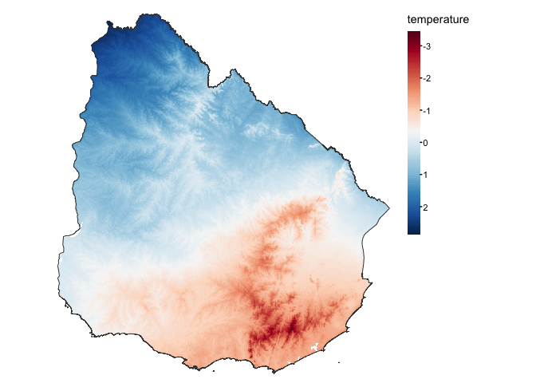

The model assumes an underlying Poisson point pattern and a Gaussian
response, with intensity $\lambda$ of species 1 and 2 given by:

$\lambda_1 = peak_1 \times exp^{(-1/2 \times \dfrac{(temp - \mu_1)^2}{\sigma_1^2} + e_1)}$  
$\lambda_2 = peak_2 \times exp^{(-1/2 \times \dfrac{(temp - \mu_2)^2}{\sigma_2^2} + e_2)}$

where $temp$ is the predictor, $\mu_1$ and $\mu_2$ are the niche mean for each
species, and $\sigma_1$ and $\sigma_2$ represent the niche breath. The
variables $peak_1$ and $peak_2$ are constants to that set the expected
abundance at the mean.  

Both species are associated through a residuals $e_1$ and $e_2$:

$e_{ij} \sim \textsf{MVN}(0, \Sigma)$

Residuals have a multivariate (bivariate) normal distribution with mean
zero and covariance matrix,

$\Sigma = \begin{bmatrix} var_{1,1} & cov_{1,2}
          \\\ cov_{2,1} & var_{2,2} \end{bmatrix}$

The inverse of the covariance matrix is called the precision matrix,
denoted by $\tau = {\Sigma}^{-1}$.

### Function

The function `two2tango()` needs the following arguments:

- `mu_1` = $\mu_1$ and `mu_2` = $\mu_2$: the mean of the response curve
  (niche mean) for each species,  
- `sigma_1` = $\sigma_1$ and `sigma_2` = $\sigma_2$: the SD of the
  response curve (niche breath) for each species,  
- `peak_1` = $peak_1$ and `peak_2` = $peak_2$: constants that set the
  expected abundance at the mean,  
- `var` = $var_{1,1}$ = $var_{2,2}$: the variance of each species, which
  will always be set to `1`,
- `cov1` = $cov_{1,2}$ and $cov_{2,1}$: the covariance of one species
  against the other, which needs to be symmetric.

Then it returns a list with two `sf` objects of `POINT` geometry, one
for each species.

``` r
library(spatstat)
library(tmap)
tmap_mode("plot")
library(terra)
library(gstat)
library(sf)
library(tidyverse)

# functions
source('code/two2tango.R')
source('code/auxiliary.R')
```

## Test the function

We will use as an example covariate the average annual temperature for
Uruguay

``` r
uruguay <- geodata::gadm(country = 'UY', level=0, path = 'data/')
temperature <- geodata::worldclim_country('UY', var = 'tavg', path = 'data/')
temperature <- mean(temperature, na.rm=T) %>% mask(uruguay)
temp <- scale(temperature)

tm_shape(temp) +
  tm_raster(col.scale = tm_scale_continuous(midpoint = NA, values = 'brewer.rd_bu'),
            col.legend = tm_legend('temperature')) +
tm_shape(uruguay) +
  tm_borders() +
  tm_layout(frame=F, legend.frame = F)
```



### Case 1

Species have the same niche and co-occur

|       | $\mu_1$ | $\sigma_1$ | $peak_1$ | $var$ | $cov$ |
|-------|---------|------------|----------|-------|-------|
| `sp1` | 0.5     | 0.5        | 60       | 1     | 0.9   |
| `sp2` | 0.5     | 0.5        | 60       | 1     | 0.9   |

``` r
mu1 = 0.5
mu2 = 0.5
sigma1 = 0.5
sigma2 = 0.5
peak1 = 60
peak2 = 60
cov= 0.9

simulated_species <- two2tango(peak1=peak1, peak2=peak2,
                               mu1=mu1, sigma1=sigma1,
                               mu2=mu2, sigma2=sigma2,
                               cov=cov,
                               predictor = temp)

sp1 <- simulated_species[[1]] %>% mutate(species = 'sp1')
sp2 <- simulated_species[[2]] %>% mutate(species = 'sp2')
```

<details class="code-fold">
<summary>Code</summary>

``` r
tm_shape(temp) +
  tm_raster(col.scale = tm_scale_continuous(midpoint = NA, values = 'brewer.rd_bu'),
            col.legend = tm_legend('')) +
tm_shape(uruguay) + tm_borders() +
tm_shape(sp1) +
  tm_dots(fill='species',
          fill.scale = tm_scale_categorical(values='red'),
          fill.legend = tm_legend(''), size = 0.5) +
tm_shape(sp2) +
  tm_dots(fill='species',
          fill.scale = tm_scale_categorical(values='black'),
          fill.legend = tm_legend(''), size = 0.5) +
  tm_layout(frame=F, legend.frame = F)
```
</details>


<details class="code-fold">
<summary>Code</summary>

``` r
response.df <- tibble(x = seq(-3, 3, by = 0.01),
                      y1 = spec.response(x, mu1, peak1, sigma1),
                      y2 = spec.response(x, mu2, peak2, sigma2))

ggplot() +
    geom_line(data=response.df, aes(x=x, y=y1), col='red', linetype = 'dashed') +
    geom_point(data=response.df, aes(x=x, y=y1), col='red') +
    geom_line(data=response.df, aes(x=x, y=y2), col='black') +
    geom_line(data=response.df, aes(x=x, y=y2), col='black') +
    labs(y='Y') + theme_bw()
```

</details>


### Case 2

Species have a different niche and negative co-occurrence

|       | $\mu_1$ | $\sigma_1$ | $peak_1$ | $var$ | $cov$ |
|-------|---------|------------|----------|-------|-------|
| `sp1` | 0.25    | 0.5        | 60       | 1     | -0.9  |
| `sp2` | -0.25   | 0.5        | 60       | 1     | -0.9  |

``` r
mu1 = 0.25
mu2 = -0.25
sigma1 = 0.5
sigma2 = 0.5
peak1 = 60
peak2 = 60
cov= -0.9

simulated_species <- two2tango(peak1=peak1, peak2=peak2,
                               mu1=mu1, sigma1=sigma1,
                               mu2=mu2, sigma2=sigma2,
                               cov=cov,
                               predictor = temp)

sp1 <- simulated_species[[1]] %>% mutate(species = 'sp1')
sp2 <- simulated_species[[2]] %>% mutate(species = 'sp2')

```

<details class="code-fold">
<summary>Code</summary>

``` r
tm_shape(temp) +
  tm_raster(col.scale = tm_scale_continuous(midpoint = NA, values = 'brewer.rd_bu'),
            col.legend = tm_legend('')) +
tm_shape(uruguay) + tm_borders() +
tm_shape(sp1) +
  tm_dots(fill='species',
          fill.scale = tm_scale_categorical(values='red'),
          fill.legend = tm_legend(''), size = 0.5) +
tm_shape(sp2) +
  tm_dots(fill='species',
          fill.scale = tm_scale_categorical(values='black'),
          fill.legend = tm_legend(''), size = 0.5) +
  tm_layout(frame=F, legend.frame = F)
```

</details>


<details class="code-fold">
<summary>Code</summary>

``` r
response.df <- tibble(x = seq(-3, 3, by = 0.01),
                      y1 = spec.response(x, mu1, peak1, sigma1),
                      y2 = spec.response(x, mu2, peak2, sigma2))

ggplot() +
    geom_line(data=response.df, aes(x=x, y=y1), col='red', linetype = 'dashed') +
    geom_point(data=response.df, aes(x=x, y=y1), col='red') +
    geom_line(data=response.df, aes(x=x, y=y2), col='black') +
    geom_line(data=response.df, aes(x=x, y=y2), col='black') +
    labs(y='Y') + theme_bw()
```

</details>


